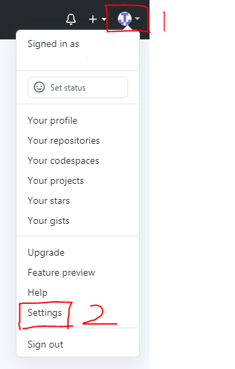
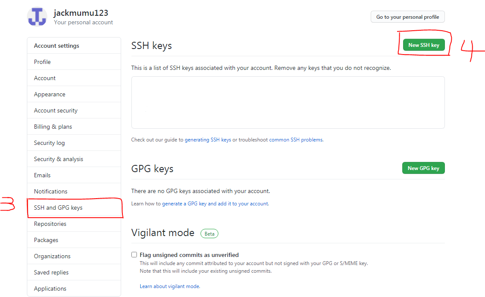
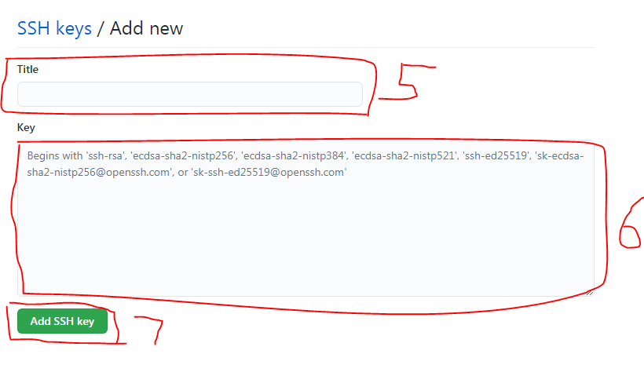
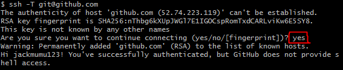
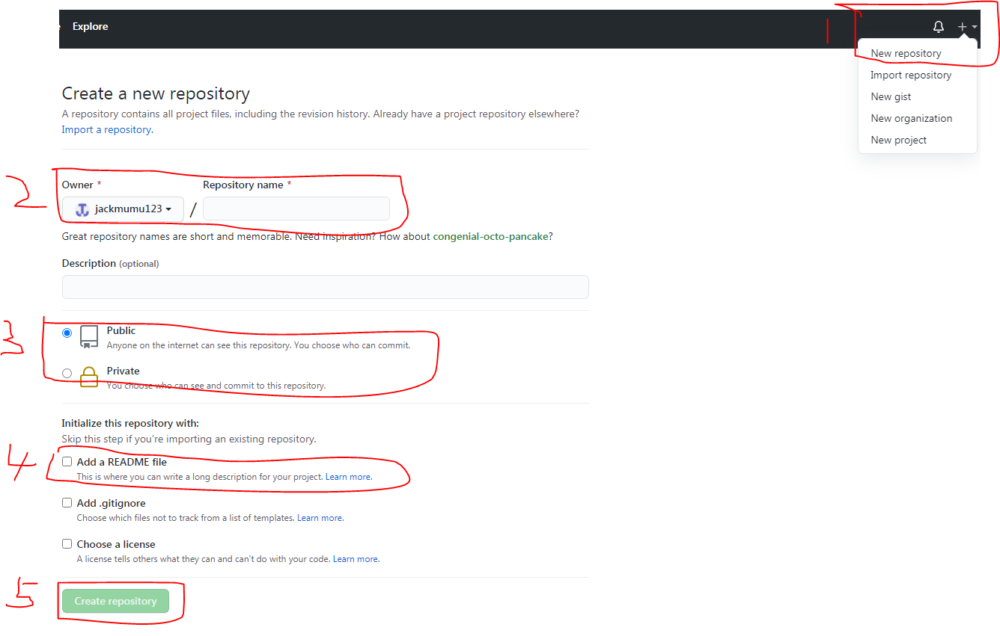

#          **github操作文档**

1. 下载安装git和typora客户端

   下载地址：https://git-scm.com/downloads

   ​                   https://www.typora.io/

2. 打开Git Bash客户端生成SSH Keys，命令如下：

   ```
   1)git config --global user.email 你的邮箱
   2)git config --global user.name 你的名字
   3)ls -al ~/.ssh
   4)ssh-keygen -t rsa -C "自己的github账号"
   ```

   以上命令运行后默认会在C:\Users\jack（根据自己计算机用户名找）目录下生成.ssh文件夹，该文件下面有两个文件id_rsa是私钥，id_rsa.pub是公钥

   3.复制id_rsa.pub文件里的公钥到github官网自己账户下的SSH and GPG keys里，操作如下截图所示：

   





4.使用命令测试是否成功：ssh -T git@github.com

出现提示点击yes回车即可



5.建立Github仓库，如图所示

  



6.克隆远程github仓库到本地，命令

 git clone “第5步建立的仓库ssh地址”

7.到克隆的目录下面新建填写文档，然后使用命令更新同步到远程github仓库

```
git add -A
git commit -m "seccessful"
git push
```

